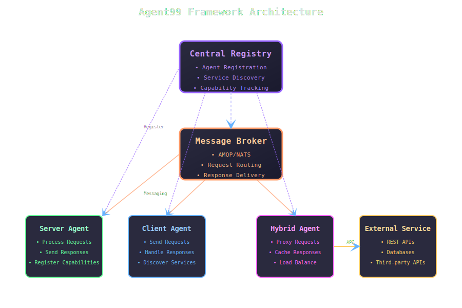
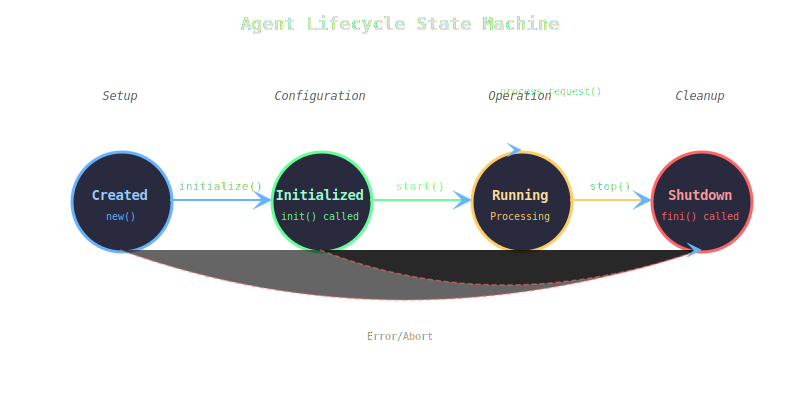
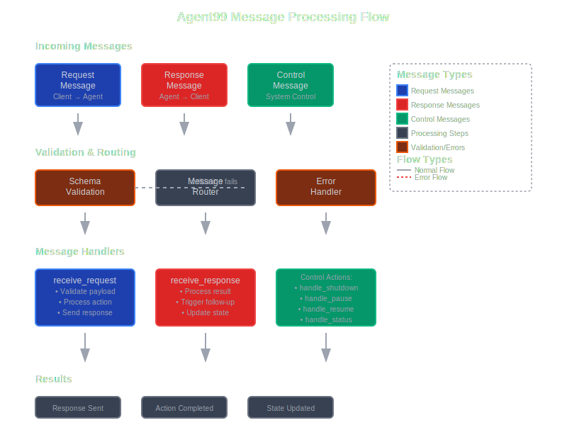
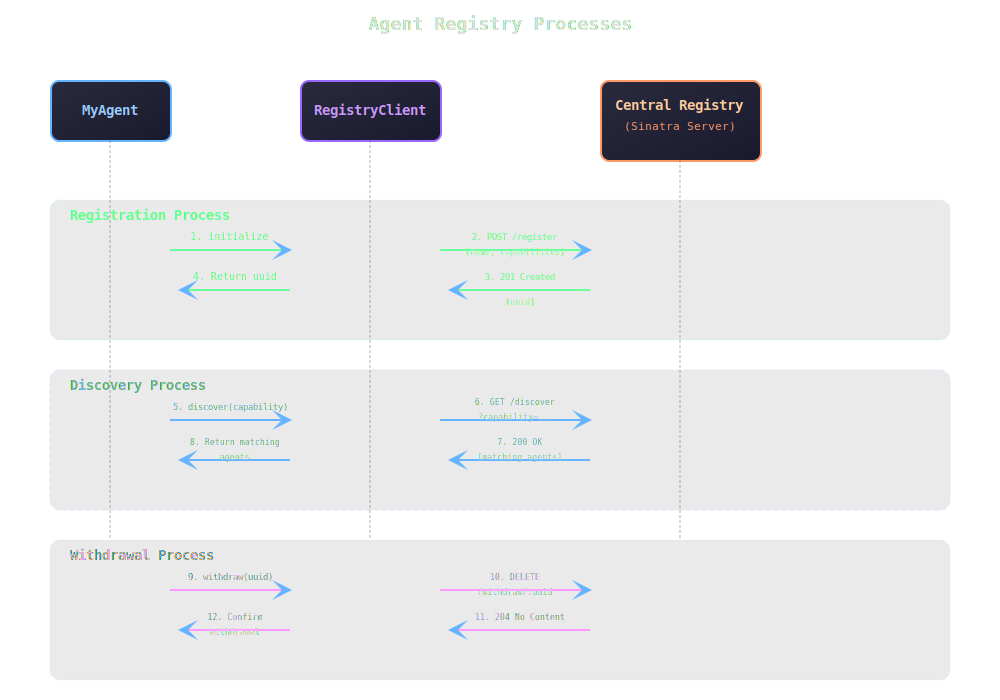

# Agent99
<br/>

> [!CAUTION]
> ## ⚠️ Under Development ⚠️
> Initial release has no AI components - it's a generic client-server / request-response micro-services system using peer-to-peer messaging and centralized agent registry. Review [The Changelog](./CHANGELOG.md) for version changes.
<br /><br />

<div align="center">
  <table>
    <tr>
      <td width="40%" align="center" valign="top">
        
        <br /><br />
        [Comprehensive Documentation Website](https://madbomber.github.io/agent99/)
      </td>
      <td width="60%" align="left" valign="top">
        Agent99 is a Ruby-based framework for building and managing intelligent software agents in a distributed system. Like the clever Agent 99 from Get Smart, your agents will be smart, adaptable, and ready to tackle any challenge through seamless peer-to-peer communication and centralized discovery.
        <br/><br/>
        <h3>Key Features</h3>
        <ul>
            <li><strong>🌐 <a href="#agent-discovery">Agent Discovery</a></strong> - Find agents by capabilities</li>
            <li><strong>📡 <a href="#flexible-communication">Peer-to-Peer Messaging</a></strong> - AMQP & NATS support</li>
            <li><strong>🔄 <a href="#message-processing">Message Processing</a></strong> - Requests, responses & control</li>
            <li><strong>📋 <a href="#registry-integration">Registry Integration</a></strong> - Centralized agent registry</li>
            <li><strong>⚡ <a href="#control-actions">Control Actions</a></strong> - Pause, resume, update agents</li>
            <li><strong>🔧 <a href="#agent-lifecycle-management">Lifecycle Management</a></strong> - Easy setup & teardown</li>
            <li><strong>🚀 <a href="#multi-agent-processing">Multi-Agent Processing</a></strong> - Thread isolation support</li>
            <li><strong>📊 <a href="#error-handling-and-logging">Error Handling & Logging</a></strong> - Built-in management</li>
        </ul>
      </td>
    </tr>
  </table>
</div>

## Table of Contents

* [Quick Start](#quick-start)
* [Prerequisites](#prerequisites)
* [Architecture Overview](#architecture-overview)
* [Installation](#installation)
* [Usage](#usage)
* [Configuration](#configuration)
* [Agent Lifecycle](#agent-lifecycle)
* [Message Processing](#message-processing)
* [Registry Integration](#registry-integration)
* [Examples](#examples)
* [Evolving Standards](#evolving-standards)
* [Contributing](#contributing)
* [Roadmap](#roadmap)
* [License](#license)

## Quick Start

Jump right in with our step-by-step guide:

1. **Prerequisites**: [Install message broker](#prerequisites) (NATS or RabbitMQ)
2. **Install Agent99**: Add to Gemfile and bundle install
3. **Start Registry**: Launch the central agent registry
4. **Create Your First Agent**: Build a simple greeter agent
5. **Test Communication**: Verify agents can discover and communicate

📖 **Detailed walkthrough**: [Getting Started Guide](docs/getting-started/quick-start.md)

## Prerequisites

Agent99 requires a message broker for inter-agent communication. Choose one:

### NATS (Recommended)
```bash
# macOS
brew install nats-server

# Start NATS
nats-server
```

### RabbitMQ  
```bash
# macOS
brew install rabbitmq

# Start RabbitMQ
brew services start rabbitmq
```

📋 **More installation options**: [Installation Guide](docs/getting-started/installation.md)

## Architecture Overview



Agent99 follows a distributed architecture with three core components:

- **🏛️ Central Registry**: Service discovery and agent registration
- **📡 Message Broker**: Peer-to-peer communication backbone (NATS/AMQP)
- **🤖 Agents**: Independent services with specific capabilities

📚 **Deep dive**: [Architecture Documentation](docs/core-concepts/architecture.md)

## Installation

Add this line to your application's Gemfile:

```ruby
gem 'agent99'
```

And then execute:

```
$ bundle install
```

Or install it yourself as:

```
$ gem install agent99
```

## Usage

Create your first agent in three simple steps:

### 1. Define Request Schema
```ruby
class GreeterRequest < SimpleJsonSchemaBuilder::Base
  object do
    object :header, schema: Agent99::HeaderSchema
    string :name, required: true, examples: ["World"]
  end
end
```

### 2. Implement Agent Class
```ruby
class GreeterAgent < Agent99::Base
  def info
    {
      name: self.class.to_s,
      type: :server,
      capabilities: ['greeter', 'hello_world'],
      request_schema: GreeterRequest.schema
    }
  end

  def process_request(payload)
    name = payload.dig(:name)
    send_response(result: "Hello, #{name}!")
  end
end
```

### 3. Run Your Agent
```ruby
require 'agent99'
agent = GreeterAgent.new
agent.run
```

🎯 **More examples**: [Usage Examples](docs/examples/)

## Configuration

Configure Agent99 through environment variables:

### Core Settings
- `AGENT99_REGISTRY_URL`: Registry service URL (default: `http://localhost:4567`)
- `AGENT99_LOG_LEVEL`: Logging verbosity (default: `INFO`)

### NATS Configuration
- `NATS_URL`: NATS server URL (default: `nats://localhost:4222`)
- `NATS_USER`: Username for authentication
- `NATS_PASS`: Password for authentication

### AMQP/RabbitMQ Configuration
- `RABBITMQ_URL`: RabbitMQ server URL (default: `amqp://localhost:5672`)
- `RABBITMQ_USER`: Username (default: `guest`)
- `RABBITMQ_PASS`: Password (default: `guest`)

📚 **Complete configuration guide**: [Configuration Documentation](docs/configuration/)

## Agent Lifecycle



Agent99 manages the complete lifecycle of your agents:

- **🎬 Initialization**: Agent registers with the central registry
- **⚡ Running**: Agent processes requests and sends responses
- **⏸️ Paused**: Agent temporarily stops processing (control action)
- **🔄 Updated**: Agent receives new configuration or capabilities
- **🛑 Shutdown**: Agent gracefully disconnects and cleans up

🔄 **Detailed lifecycle management**: [Agent Lifecycle Guide](docs/core-concepts/agent-lifecycle.md)

## Message Processing



Agent99 handles three types of messages:

- **📨 Requests**: Incoming work for agents to process
- **📤 Responses**: Results sent back to requesters
- **🎛️ Control**: Management commands (pause, resume, update)

Each message is validated, routed, and processed with full error handling and logging.

⚙️ **Message processing details**: [Message Processing Guide](docs/framework-components/message-processing.md)

## Registry Integration



The central registry enables dynamic service discovery:

1. **📝 Registration**: Agents announce their capabilities
2. **🔍 Discovery**: Find agents by capability or name
3. **📋 Management**: Monitor and control registered agents
4. **🚪 Withdrawal**: Clean removal from registry

The registry supports both HTTP REST API and direct client integration.

🏛️ **Registry implementation**: [Registry Documentation](docs/framework-components/agent-registry.md)

## Examples

Explore real-world implementations:

- **🚀 [Demo Runner](examples/run_demo.rb)**: Complete working system
- **👋 [Greeter Agent](examples/greeter_agent.rb)**: Simple request-response
- **🔄 [Multi-Agent System](examples/multi_agent/)**: Coordinated agents
- **📊 [Monitoring Dashboard](examples/dashboard/)**: Agent status monitoring

💡 **All examples**: [Examples Directory](docs/examples/)

## Evolving Standards

- [agntcy.org](https://agntcy.org) - Agency protocol initiative
- [Agent2Agent](https://a2a-protocol.org/latest/) - Linux Foundation protocol


## Contributing

Bug reports and pull requests are welcome on GitHub at https://github.com/MadBomber/agent99.

## Roadmap

### Short-term (v0.1.x)
- **🔍 Enhanced Discovery**: Semantic search with vector database (SQLite + embeddings)
- **📋 Schema Validation**: Complete request/response schema definitions
- **🤖 AI Integration**: RAG-enabled agents using prompts as tools
- **📊 Monitoring**: Built-in metrics and health checks

### Medium-term (v0.2.x)
- **🔐 Security**: Authentication and authorization framework
- **⚡ Performance**: Connection pooling and message batching
- **🌍 Multi-broker**: Support for multiple message brokers simultaneously
- **📈 Scaling**: Load balancing and auto-scaling capabilities

### Long-term (v1.0+)
- **🧠 Intelligence**: Built-in ML/AI capabilities
- **🔗 Interoperability**: Full Agent2Agent protocol compliance
- **☁️ Cloud-native**: Kubernetes operators and cloud integrations

⚠️ **Breaking changes**: [Migration Guide v0.0.4](docs/breaking_change_v0.0.4.md)


## License

The gem is available as open source under the terms of the [MIT License](https://opensource.org/licenses/MIT).
