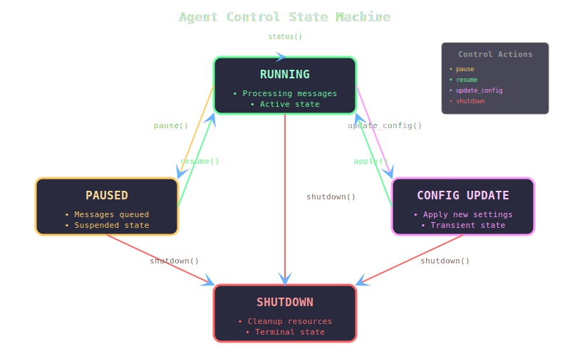

# Agent99 Framework

## Control Actions

Agent99 provides a robust control system that allows for dynamic management of agents during runtime. Control actions enable administrative operations and state management without requiring agent restarts or redeployment.



### Built-in Control Actions

The framework includes several built-in control actions:

#### shutdown
- Gracefully stops the agent
- Withdraws registration from the registry
- Cleans up resources and connections
- Triggers the `fini` method
- Example usage:
```ruby
{
  header: {
    type: "control",
    to_uuid: "target_agent_id",
    from_uuid: "control_agent_id",
    event_uuid: "evt_123",
    timestamp: 1638360000000000
  },
  action: "shutdown"
}
```

#### pause
TODO: haven't decided whether messages are left in the messaging network or whether they should be queued within the agent.  TBD

- Temporarily halts message processing
- Maintains agent registration
- Continues to accept control messages
- Queues other messages for later processing
- Example usage:
```ruby
{
  header: {
    type: "control",
    to_uuid: "target_agent_id",
    from_uuid: "control_agent_id",
    event_uuid: "evt_456",
    timestamp: 1638360000000000
  },
  action: "pause"
}
```

#### resume
- Reactivates a paused agent
- Processes any queued messages
- Restores normal operation
- Example usage:
```ruby
{
  header: {
    type: "control",
    to_uuid: "target_agent_id",
    from_uuid: "control_agent_id",
    event_uuid: "evt_789",
    timestamp: 1638360000000000
  },
  action: "resume"
}
```

#### update_config

TODO: This is still TBD waiting for the design of the overall configuration class.

- Updates agent configuration at runtime
- Allows dynamic behavior modification
- Example usage:
```ruby
{
  header: {
    type: "control",
    to_uuid: "target_agent_id",
    from_uuid: "control_agent_id",
    event_uuid: "evt_101",
    timestamp: 1638360000000000
  },
  action: "update_config",
  config: {
    "log_level": "DEBUG",
    "timeout": 30
  }
}
```

#### status
- Requests current agent status
- Returns operational statistics
- Example usage:
```ruby
{
  header: {
    type: "control",
    to_uuid: "target_agent_id",
    from_uuid: "control_agent_id",
    event_uuid: "evt_102",
    timestamp: 1638360000000000
  },
  action: "status"
}
```

### Implementing Custom Control Actions

You can implement custom control actions by:

1. Adding a handler method to your agent class:
```ruby
def handle_custom_action
  # Implementation
  send_control_response(status: "custom action completed")
end
```

2. Registering the handler in CONTROL_HANDLERS:
```ruby
CONTROL_HANDLERS.merge!({
  'custom_action' => :handle_custom_action
})
```

### Best Practices

1. **Response Handling**
    - Always send a control response
    - Include relevant status information
    - Handle errors gracefully

2. **State Management**
    - Maintain consistent state transitions
    - Document state dependencies
    - Handle edge cases (e.g., pause while paused)

3. **Security Considerations**
    - Validate control message sources
    - Implement appropriate authorization
    - Log all control actions

4. **Error Recovery**
    - Implement timeout mechanisms
    - Handle partial failures
    - Provide status feedback

### Control Flow Example

```ruby
class MyAgent < Agent99::Base
  def handle_custom_restart
    begin
      cleanup_resources
      reinitialize_state
      send_control_response(status: "restart completed")
    rescue StandardError => e
      send_control_response(
        status: "restart failed",
        error: e.message
      )
    end
  end
end
```

### Monitoring Control Actions

All control actions are automatically logged with:
   * Timestamp
   * Action type
   * Source agent
   * Result status
   * Error information (if any)

This enables effective monitoring and troubleshooting of agent behavior and system state.
