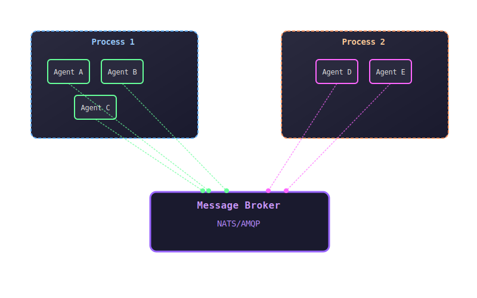

# Multi-Agent Processing

Multi-agent processing allows you to run multiple agents within the same process or coordinate agents across different processes. This guide covers patterns, strategies, and best practices for multi-agent systems.

## Overview



## Single Process, Multiple Agents

Running multiple agents in the same Ruby process can be efficient for related services that need to share resources.

### Basic Multi-Agent Setup

```ruby
require 'agent99'

# Define your agents
class DatabaseAgent < Agent99::Base
  def info
    {
      name: self.class.to_s,
      type: :server,
      capabilities: ['database', 'storage']
    }
  end

  def process_request(payload)
    # Database operations
    operation = payload.dig(:operation)
    case operation
    when 'store'
      result = store_data(payload[:data])
      send_response(result: result)
    when 'retrieve'
      data = retrieve_data(payload[:id])
      send_response(data: data)
    else
      send_error("Unknown operation: #{operation}")
    end
  end
end

class CacheAgent < Agent99::Base
  def initialize
    super
    @cache = {}
  end

  def info
    {
      name: self.class.to_s,
      type: :server,
      capabilities: ['cache', 'memory']
    }
  end

  def process_request(payload)
    key = payload.dig(:key)
    case payload.dig(:operation)
    when 'get'
      send_response(value: @cache[key])
    when 'set'
      @cache[key] = payload[:value]
      send_response(status: 'stored')
    when 'delete'
      @cache.delete(key)
      send_response(status: 'deleted')
    end
  end
end

class LoggingAgent < Agent99::Base
  def info
    {
      name: self.class.to_s,
      type: :server,
      capabilities: ['logging', 'audit']
    }
  end

  def process_request(payload)
    # Log the event
    log_entry = {
      timestamp: Time.now.iso8601,
      level: payload[:level] || 'info',
      message: payload[:message],
      source: payload[:source]
    }
    
    File.open('agent_audit.log', 'a') do |f|
      f.puts log_entry.to_json
    end
    
    send_response(status: 'logged', entry_id: SecureRandom.uuid)
  end
end

# Multi-agent process manager
class MultiAgentProcess
  def initialize
    @agents = []
    @threads = []
    @running = false
  end

  def add_agent(agent_class, options = {})
    agent = agent_class.new(options)
    @agents << agent
    agent
  end

  def start_all
    @running = true
    
    @agents.each do |agent|
      thread = Thread.new do
        begin
          agent.run
        rescue => e
          puts "Agent #{agent.class} failed: #{e.message}"
        end
      end
      @threads << thread
    end

    puts "Started #{@agents.size} agents in #{@threads.size} threads"
    self
  end

  def stop_all
    @running = false
    
    @agents.each(&:shutdown)
    @threads.each(&:join)
    
    puts "All agents stopped"
  end

  def wait_for_shutdown
    trap('INT') do
      puts "\nShutting down all agents..."
      stop_all
      exit
    end

    @threads.each(&:join)
  end
end

# Usage
if __FILE__ == $0
  process = MultiAgentProcess.new
  
  # Add agents to the process
  process.add_agent(DatabaseAgent)
  process.add_agent(CacheAgent)  
  process.add_agent(LoggingAgent)
  
  # Start all agents
  process.start_all
  
  # Wait for shutdown signal
  process.wait_for_shutdown
end
```

## Agent Coordination Patterns

### Producer-Consumer Pattern

```ruby
class ProducerAgent < Agent99::Base
  def initialize
    super
    @job_counter = 0
  end

  def info
    {
      name: self.class.to_s,
      type: :hybrid,
      capabilities: ['producer', 'job_generator']
    }
  end

  def start_producing
    Thread.new do
      loop do
        # Find consumer agents
        consumers = discover_agents(['consumer'])
        
        if consumers.any?
          # Create a job
          job = create_job
          
          # Send to a random consumer
          consumer = consumers.sample
          send_request(consumer[:name], job)
          
          logger.info "Sent job #{job[:id]} to #{consumer[:name]}"
        else
          logger.warn "No consumers available"
        end
        
        sleep(5) # Produce every 5 seconds
      end
    end
  end

  def process_request(payload)
    # Handle requests for job status, etc.
    case payload[:operation]
    when 'status'
      send_response(jobs_produced: @job_counter, status: 'running')
    end
  end

  private

  def create_job
    @job_counter += 1
    {
      id: "job_#{@job_counter}",
      type: 'data_processing',
      data: Array.new(100) { rand(1000) },
      created_at: Time.now.iso8601
    }
  end
end

class ConsumerAgent < Agent99::Base
  def initialize
    super
    @processed_jobs = 0
  end

  def info
    {
      name: "#{self.class}_#{Socket.gethostname}_#{Process.pid}",
      type: :server,
      capabilities: ['consumer', 'data_processor']
    }
  end

  def process_request(payload)
    job_id = payload.dig(:id)
    job_type = payload.dig(:type)
    
    logger.info "Processing job #{job_id} of type #{job_type}"
    
    # Simulate processing time
    processing_time = rand(1..3)
    sleep(processing_time)
    
    # Process the data
    data = payload.dig(:data) || []
    result = data.sum / data.size.to_f rescue 0
    
    @processed_jobs += 1
    
    send_response(
      job_id: job_id,
      result: result,
      processing_time: processing_time,
      processed_by: info[:name],
      total_processed: @processed_jobs
    )
    
    logger.info "Completed job #{job_id}"
  end
end
```

### Load Balancing Pattern

```ruby
class LoadBalancerAgent < Agent99::Base
  def initialize
    super
    @worker_stats = {}
    @request_count = 0
  end

  def info
    {
      name: self.class.to_s,
      type: :hybrid,
      capabilities: ['load_balancer', 'proxy']
    }
  end

  def process_request(payload)
    @request_count += 1
    
    # Find available worker agents
    workers = discover_agents(['worker'])
    
    if workers.empty?
      return send_error("No workers available", "NO_WORKERS")
    end

    # Choose worker based on load balancing strategy
    chosen_worker = choose_worker(workers)
    
    # Forward request to chosen worker
    begin
      response = send_request(chosen_worker[:name], payload)
      
      # Update worker stats
      update_worker_stats(chosen_worker[:name], success: true)
      
      # Add load balancer info to response
      response[:routed_by] = info[:name]
      response[:worker] = chosen_worker[:name]
      
      send_response(response)
    rescue => e
      update_worker_stats(chosen_worker[:name], success: false)
      send_error("Worker failed: #{e.message}", "WORKER_ERROR")
    end
  end

  private

  def choose_worker(workers)
    # Round-robin load balancing
    worker_index = @request_count % workers.size
    workers[worker_index]
  end

  def update_worker_stats(worker_name, success:)
    @worker_stats[worker_name] ||= { requests: 0, successes: 0, failures: 0 }
    @worker_stats[worker_name][:requests] += 1
    
    if success
      @worker_stats[worker_name][:successes] += 1
    else
      @worker_stats[worker_name][:failures] += 1
    end
  end
end

class WorkerAgent < Agent99::Base
  def initialize(worker_id = nil)
    super()
    @worker_id = worker_id || "worker_#{SecureRandom.hex(4)}"
  end

  def info
    {
      name: "#{self.class}_#{@worker_id}",
      type: :server,
      capabilities: ['worker', 'processing']
    }
  end

  def process_request(payload)
    # Simulate different processing capabilities
    task_type = payload.dig(:task_type)
    
    case task_type
    when 'cpu_intensive'
      result = perform_cpu_task(payload[:data])
    when 'io_intensive'
      result = perform_io_task(payload[:data])
    when 'memory_intensive'
      result = perform_memory_task(payload[:data])
    else
      result = perform_generic_task(payload[:data])
    end

    send_response(
      result: result,
      worker_id: @worker_id,
      task_type: task_type,
      processed_at: Time.now.iso8601
    )
  end

  private

  def perform_cpu_task(data)
    # Simulate CPU-intensive work
    (1..1000000).sum
  end

  def perform_io_task(data)
    # Simulate I/O work
    File.write("/tmp/worker_#{@worker_id}_output.txt", data.to_s)
    "Data written to file"
  end

  def perform_memory_task(data)
    # Simulate memory-intensive work
    large_array = Array.new(100000) { rand }
    large_array.sum
  end

  def perform_generic_task(data)
    # Generic task processing
    "Processed: #{data}"
  end
end
```

## Multi-Process Coordination

### Process Manager

```ruby
class AgentProcessManager
  def initialize
    @processes = {}
  end

  def start_agent_process(agent_class, count: 1, options: {})
    count.times do |i|
      process_name = "#{agent_class.name.downcase}_#{i}"
      
      pid = fork do
        # Set process title for easier identification
        Process.setproctitle("agent99_#{process_name}")
        
        # Create and run the agent
        agent = agent_class.new(options)
        
        # Handle graceful shutdown
        trap('TERM') do
          agent.shutdown
          exit
        end
        
        agent.run
      end
      
      @processes[process_name] = {
        pid: pid,
        agent_class: agent_class,
        started_at: Time.now
      }
      
      puts "Started #{agent_class} as process #{pid} (#{process_name})"
    end
  end

  def stop_all_processes
    @processes.each do |name, process_info|
      begin
        Process.kill('TERM', process_info[:pid])
        Process.wait(process_info[:pid])
        puts "Stopped process #{name} (#{process_info[:pid]})"
      rescue Errno::ESRCH
        puts "Process #{name} (#{process_info[:pid]}) already stopped"
      end
    end
    
    @processes.clear
  end

  def monitor_processes
    Thread.new do
      loop do
        @processes.each do |name, process_info|
          begin
            # Check if process is still running
            Process.getpgid(process_info[:pid])
          rescue Errno::ESRCH
            puts "Process #{name} (#{process_info[:pid]}) died, restarting..."
            restart_process(name, process_info)
          end
        end
        
        sleep(5) # Check every 5 seconds
      end
    end
  end

  def wait_for_shutdown
    trap('INT') do
      puts "\nShutting down all agent processes..."
      stop_all_processes
      exit
    end

    # Wait for all child processes
    Process.waitall
  end

  private

  def restart_process(name, process_info)
    # Remove dead process
    @processes.delete(name)
    
    # Start new process
    start_agent_process(
      process_info[:agent_class], 
      count: 1,
      options: process_info[:options] || {}
    )
  end
end

# Usage example
if __FILE__ == $0
  manager = AgentProcessManager.new
  
  # Start multiple instances of different agents
  manager.start_agent_process(WorkerAgent, count: 3)
  manager.start_agent_process(LoadBalancerAgent, count: 1)
  manager.start_agent_process(LoggingAgent, count: 1)
  
  # Start process monitoring
  manager.monitor_processes
  
  # Wait for shutdown
  manager.wait_for_shutdown
end
```

## Performance Considerations

### Memory Management

```ruby
class MemoryEfficientAgent < Agent99::Base
  def initialize
    super
    @request_count = 0
    @memory_check_interval = 100
  end

  def process_request(payload)
    @request_count += 1
    
    # Periodic memory check
    if @request_count % @memory_check_interval == 0
      check_memory_usage
    end
    
    # Process request with memory awareness
    result = process_with_memory_limit(payload)
    send_response(result)
  end

  private

  def check_memory_usage
    # Get current memory usage
    memory_mb = `ps -o rss= -p #{Process.pid}`.to_i / 1024
    
    if memory_mb > 500 # 500MB limit
      logger.warn "High memory usage: #{memory_mb}MB"
      
      # Trigger garbage collection
      GC.start
      
      # Check again after GC
      new_memory_mb = `ps -o rss= -p #{Process.pid}`.to_i / 1024
      logger.info "Memory after GC: #{new_memory_mb}MB"
    end
  end

  def process_with_memory_limit(payload)
    # Implement memory-conscious processing
    if payload[:data]&.size > 10000
      # Stream process large data instead of loading all at once
      process_large_data_streaming(payload[:data])
    else
      # Normal processing for small data
      process_small_data(payload[:data])
    end
  end
end
```

### Thread Pool Management

```ruby
require 'concurrent-ruby'

class ThreadPoolAgent < Agent99::Base
  def initialize(options = {})
    super(options)
    
    # Create thread pools for different task types
    @cpu_pool = Concurrent::ThreadPoolExecutor.new(
      min_threads: 2,
      max_threads: 4,
      max_queue: 100
    )
    
    @io_pool = Concurrent::ThreadPoolExecutor.new(
      min_threads: 5,
      max_threads: 20,
      max_queue: 1000
    )
  end

  def process_request(payload)
    task_type = payload.dig(:task_type)
    
    # Choose appropriate thread pool
    pool = case task_type
           when 'cpu_intensive'
             @cpu_pool
           when 'io_intensive', 'network'
             @io_pool
           else
             @cpu_pool
           end

    # Execute in thread pool
    future = Concurrent::Future.execute(executor: pool) do
      perform_task(payload)
    end

    # Wait for completion with timeout
    begin
      result = future.value(30) # 30 second timeout
      send_response(result)
    rescue Concurrent::TimeoutError
      send_error("Task timed out", "TIMEOUT")
    rescue => e
      send_error("Task failed: #{e.message}", "EXECUTION_ERROR")
    end
  end

  def shutdown
    # Shutdown thread pools gracefully
    [@cpu_pool, @io_pool].each do |pool|
      pool.shutdown
      unless pool.wait_for_termination(10)
        pool.kill
      end
    end
    
    super
  end
end
```

## Best Practices

### 1. Resource Management
- **Limit agent count**: Don't run too many agents per process
- **Monitor memory**: Set limits and monitor usage
- **Use thread pools**: Prevent thread explosion
- **Clean up resources**: Properly shutdown agents and connections

### 2. Communication Patterns
- **Use discovery**: Don't hardcode agent names
- **Handle failures**: Agents may come and go
- **Implement timeouts**: Prevent hanging requests
- **Use circuit breakers**: Protect against cascade failures

### 3. Monitoring and Debugging
- **Log extensively**: Track agent interactions
- **Use unique names**: Include process/thread identifiers
- **Monitor performance**: Track request rates and response times
- **Health checks**: Implement agent health endpoints

### 4. Testing Multi-Agent Systems
- **Integration tests**: Test agent interactions
- **Load testing**: Test under realistic load
- **Failure scenarios**: Test agent failures and recovery
- **Distributed tracing**: Track requests across agents

## Next Steps

- **[Control Actions](control-actions.md)** - Managing agent lifecycle
- **[Advanced Features](advanced-features.md)** - Dynamic loading and deployment
- **[Performance Considerations](../operations/performance-considerations.md)** - Optimization strategies