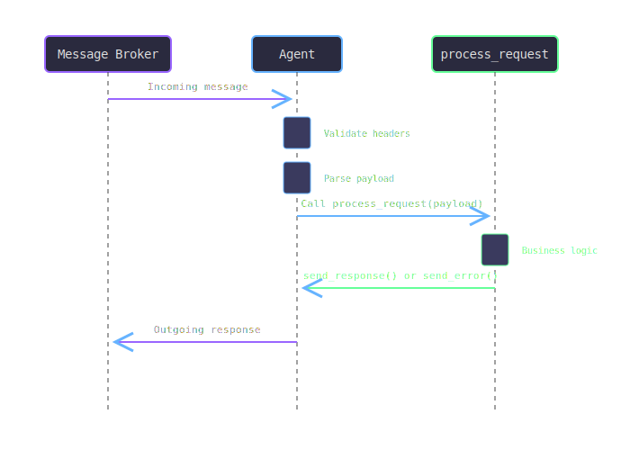

# Request & Response Handling

Understanding how to properly handle requests and responses is fundamental to building robust Agent99 applications. This guide covers patterns, best practices, and advanced techniques.

## Request Processing Lifecycle



## Basic Request Handling

### Simple Request Processing

```ruby
class SimpleAgent < Agent99::Base
  def process_request(payload)
    # Extract data from payload
    user_name = payload.dig(:name) || "Anonymous"
    
    # Perform business logic
    greeting = generate_greeting(user_name)
    
    # Send response
    send_response(message: greeting)
  end

  private

  def generate_greeting(name)
    "Hello, #{name}! Welcome to Agent99."
  end
end
```

### With Input Validation

```ruby
class ValidatingAgent < Agent99::Base
  def process_request(payload)
    # Validate required fields
    unless payload.key?(:user_id)
      return send_error("Missing required field: user_id", "MISSING_FIELD")
    end
    
    unless payload[:user_id].is_a?(String) && !payload[:user_id].empty?
      return send_error("Invalid user_id: must be non-empty string", "INVALID_FORMAT")
    end
    
    # Process valid request
    result = lookup_user_data(payload[:user_id])
    send_response(result)
  end

  private

  def lookup_user_data(user_id)
    # Simulate database lookup
    {
      user_id: user_id,
      name: "User #{user_id}",
      status: "active",
      last_seen: Time.now.iso8601
    }
  end
end
```

## Advanced Request Patterns

### Asynchronous Processing

For long-running operations, acknowledge receipt immediately and process asynchronously:

```ruby
class AsyncProcessingAgent < Agent99::Base
  def initialize
    super
    @job_queue = Queue.new
    @worker_thread = Thread.new { process_jobs }
  end

  def process_request(payload)
    job_id = SecureRandom.uuid
    
    # Acknowledge receipt immediately
    send_response(
      status: "accepted",
      job_id: job_id,
      message: "Request queued for processing"
    )
    
    # Queue for background processing
    @job_queue << {
      id: job_id,
      payload: payload,
      requester: current_request_id
    }
  end

  private

  def process_jobs
    while job = @job_queue.pop
      begin
        result = perform_long_operation(job[:payload])
        
        # Send completion notification (if supported)
        notify_completion(job[:requester], job[:id], result)
      rescue => e
        logger.error "Job #{job[:id]} failed: #{e.message}"
        notify_failure(job[:requester], job[:id], e.message)
      end
    end
  end

  def perform_long_operation(payload)
    # Simulate long operation
    sleep(5)
    { result: "Operation completed", data: payload }
  end
end
```

### Streaming Responses

For data that comes in chunks:

```ruby
class StreamingAgent < Agent99::Base
  def process_request(payload)
    file_path = payload.dig(:file_path)
    
    unless File.exist?(file_path)
      return send_error("File not found: #{file_path}", "FILE_NOT_FOUND")
    end
    
    # Send initial response
    send_response(
      status: "streaming",
      total_size: File.size(file_path),
      chunk_size: 1024
    )
    
    # Stream file contents
    File.open(file_path, 'rb') do |file|
      chunk_number = 0
      while chunk = file.read(1024)
        send_chunk(chunk_number, chunk)
        chunk_number += 1
      end
    end
    
    # Send completion marker
    send_completion()
  end

  private

  def send_chunk(number, data)
    # Implementation depends on messaging system
    # This is a conceptual example
    publish_message({
      type: "chunk",
      sequence: number,
      data: Base64.encode64(data)
    })
  end

  def send_completion
    publish_message({
      type: "stream_complete"
    })
  end
end
```

## Response Patterns

### Success Responses

```ruby
# Simple success
send_response(result: "Operation successful")

# Rich success response
send_response(
  status: "success",
  data: processed_data,
  metadata: {
    processing_time: elapsed_time,
    version: "1.0.0"
  }
)

# Collection response
send_response(
  items: search_results,
  total_count: total_count,
  page: current_page,
  has_more: has_more_pages
)
```

### Error Responses

```ruby
# Simple error
send_error("Something went wrong")

# Structured error
send_error("Invalid input data", "VALIDATION_ERROR")

# Rich error response
send_error(
  "Database connection failed",
  "DATABASE_ERROR",
  {
    retry_after: 30,
    support_id: "ERR-#{SecureRandom.hex(8)}",
    details: {
      attempted_host: db_host,
      timeout: connection_timeout
    }
  }
)
```

## Request Context and Headers

### Accessing Request Headers

```ruby
class HeaderAwareAgent < Agent99::Base
  def process_request(payload)
    # Access headers from the current request
    request_id = header_value('request_id')
    user_id = header_value('user_id')
    correlation_id = header_value('correlation_id')
    
    logger.info "Processing request #{request_id} for user #{user_id}"
    
    # Use headers in processing
    if authorized_user?(user_id)
      result = perform_operation(payload)
      send_response(result)
    else
      send_error("Unauthorized access", "UNAUTHORIZED")
    end
  end

  private

  def authorized_user?(user_id)
    # Check authorization logic
    user_id && user_id.start_with?('user_')
  end
end
```

### Setting Response Headers

```ruby
def process_request(payload)
  result = process_data(payload)
  
  # Set custom headers in response
  set_header('processing_node', Socket.gethostname)
  set_header('cache_status', 'miss')
  set_header('processing_time', elapsed_time.to_s)
  
  send_response(result)
end
```

## Error Handling Strategies

### Graceful Degradation

```ruby
class ResilientAgent < Agent99::Base
  def process_request(payload)
    begin
      # Try primary service
      result = primary_service.process(payload)
      send_response(result)
    rescue PrimaryServiceError => e
      logger.warn "Primary service failed: #{e.message}"
      
      begin
        # Fallback to secondary service
        result = secondary_service.process(payload)
        result[:fallback_used] = true
        send_response(result)
      rescue SecondaryServiceError => e2
        logger.error "Both services failed: #{e2.message}"
        
        # Return cached or default result
        default_result = get_cached_result(payload) || default_response
        default_result[:degraded_service] = true
        send_response(default_result)
      end
    end
  end

  private

  def get_cached_result(payload)
    # Check cache for previous result
    cache_key = generate_cache_key(payload)
    cached_data = cache.get(cache_key)
    
    if cached_data && fresh_enough?(cached_data)
      cached_data[:from_cache] = true
      return cached_data
    end
    
    nil
  end

  def default_response
    {
      status: "service_unavailable",
      message: "Service temporarily unavailable",
      retry_after: 60
    }
  end
end
```

### Circuit Breaker Pattern

```ruby
class CircuitBreakerAgent < Agent99::Base
  def initialize
    super
    @circuit_breaker = CircuitBreaker.new(
      failure_threshold: 5,
      recovery_timeout: 30
    )
  end

  def process_request(payload)
    @circuit_breaker.call do
      # Potentially failing operation
      external_service.process(payload)
    end.then do |result|
      send_response(result)
    end.rescue do |error|
      case error
      when CircuitBreaker::OpenError
        send_error("Service temporarily unavailable", "CIRCUIT_OPEN")
      else
        send_error("Service error: #{error.message}", "SERVICE_ERROR")
      end
    end
  end
end
```

## Request Routing and Delegation

### Multi-operation Agent

```ruby
class MultiOperationAgent < Agent99::Base
  def process_request(payload)
    operation = payload.dig(:operation)
    
    case operation
    when 'create'
      handle_create(payload)
    when 'read'
      handle_read(payload)
    when 'update'
      handle_update(payload)
    when 'delete'
      handle_delete(payload)
    else
      send_error("Unknown operation: #{operation}", "INVALID_OPERATION")
    end
  end

  private

  def handle_create(payload)
    # Creation logic
    entity = create_entity(payload[:data])
    send_response(entity: entity, status: "created")
  end

  def handle_read(payload)
    # Read logic
    entity = find_entity(payload[:id])
    if entity
      send_response(entity: entity)
    else
      send_error("Entity not found", "NOT_FOUND")
    end
  end

  def handle_update(payload)
    # Update logic
    entity = update_entity(payload[:id], payload[:data])
    send_response(entity: entity, status: "updated")
  end

  def handle_delete(payload)
    # Delete logic
    delete_entity(payload[:id])
    send_response(status: "deleted")
  end
end
```

## Testing Request Handling

### Unit Testing

```ruby
require 'minitest/autorun'

class TestCalculatorAgent < Minitest::Test
  def setup
    @agent = CalculatorAgent.new
  end

  def test_successful_addition
    payload = { operation: 'add', a: 5, b: 3 }
    
    # Mock the send_response method
    response = nil
    @agent.stub(:send_response, ->(data) { response = data }) do
      @agent.process_request(payload)
    end
    
    assert_equal 8, response[:result]
    assert_equal 'add', response[:operation]
  end

  def test_division_by_zero
    payload = { operation: 'divide', a: 10, b: 0 }
    
    error_response = nil
    @agent.stub(:send_error, ->(msg, code) { 
      error_response = { message: msg, code: code } 
    }) do
      @agent.process_request(payload)
    end
    
    assert_equal 'DIVISION_BY_ZERO', error_response[:code]
  end
end
```

## Best Practices

### Do's ✅

- **Always respond**: Every request should get a response
- **Validate early**: Check inputs before processing
- **Use schemas**: Define and validate request/response structures
- **Log appropriately**: Track requests without logging sensitive data
- **Handle timeouts**: Set reasonable processing time limits
- **Provide context**: Include helpful error messages and codes

### Don'ts ❌

- **Don't block indefinitely**: Always have timeouts
- **Don't expose internals**: Keep error messages user-friendly
- **Don't ignore errors**: Handle and respond to all error conditions
- **Don't trust input**: Always validate and sanitize
- **Don't forget correlation**: Maintain request tracing across calls

## Performance Considerations

### Memory Management

```ruby
def process_request(payload)
  # Stream large data instead of loading all at once
  if payload[:data_size] > LARGE_DATA_THRESHOLD
    process_data_streaming(payload)
  else
    process_data_in_memory(payload)
  end
end
```

### Connection Pooling

```ruby
class DatabaseAgent < Agent99::Base
  def initialize
    super
    @connection_pool = ConnectionPool.new(size: 10) do
      Database.connect
    end
  end

  def process_request(payload)
    @connection_pool.with do |connection|
      result = connection.query(payload[:sql])
      send_response(rows: result.to_a)
    end
  end
end
```

## Next Steps

- **[Error Handling & Logging](error-handling-and-logging.md)** - Comprehensive error strategies
- **[Schema Definition](schema-definition.md)** - Advanced schema patterns  
- **[Advanced Features](../advanced-topics/advanced-features.md)** - Complex patterns and techniques