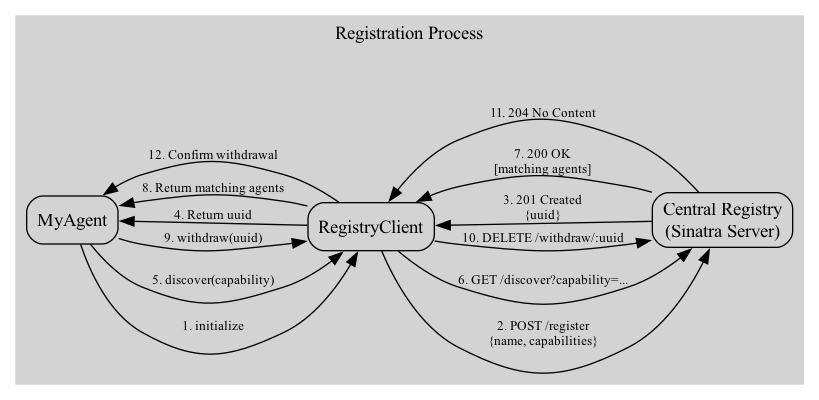

# Agent99 Framework

## Agent Registry Processes

In the Agent99 framework, an instance of the `Agent99::RegistryClient` class is responsible for registering agent capabilities with a centralized registry.  `examples/registry.rb` is a Sinatra web-app example of what a centralized regristry service should be. 

The registration process is transparent to a new instance of an `Agent99::Base` class.

First thing: start the registry.rb Sinatra app and the peer-to-peer messaging network.  The default is the `AmqpMessageClient` class.

If you do not have the RabbitMQ server installed on your Macthen then grab it using `brew install rabbitmq-server` and while you are installing software do `brew install boxes` as well since the `chief_agent.rb` example uses that little CLI tool to highlight some text in the terminal.

```bash
git clone ssh://git@github.com/MadBomber/agent99
brew install rabbitmq-server boxes
gem install agent99

cd agent99/examples
./start_rabbitmq_and_registry.sh
```

Now go into `irb` in a different terminal window and try this code ...

```ruby
require 'agent99'

# Define the Schema for the Agent's request payload

class MyAgentRequest < SimpleJsonSchemaBuilder::Base
  object do
    object :header, schema: Agent99::HeaderSchema

    string :greeting, required: false,  examples: ["Hello"]
    string :name,     required: true,   examples: ["World"]
  end
end

# Define the new Agent ....

class MyAgent < Agent99::Base
  def info
    {
      # ...
      request_schema: MyAgentRequest.schema
      capabilities:   %w[ greeter hello_world ],
      # ...
    }
  end
end

# You may create multiple instances of the agent if needed

my_agent = MyAgent.new

I, [2024-12-07T14:42:08.140286 #36471]  INFO -- : Registered Agent MyAgent with ID: 9e735449-582f-46e2-8f11-371e584d0f08
I, [2024-12-07T14:42:08.141978 #36471]  INFO -- : Created queue for agent_id: 9e735449-582f-46e2-8f11-371e584d0f08
  #=>
#<MyAgent:0x000000011d4d2e48
...

# The agent as an ID and an address in the peer-to-peer network

my_agent.id
  #=> "9e735449-582f-46e2-8f11-371e584d0f08"
```

The image below shows how the `Agent99::Base` class uses dependency injection in its constructor method to bring in an instance of the `RegristryClient` class to provide an interface to the centralized regristery service.



The above image also show the other services provided via the RegistryClient class.

The example centralized regristry service provides three processes:

1. Registration Process:
     - MyAgent initializes the RegistryClient
     - RegistryClient sends a POST request to the Central Registry
     - Central Registry responds with a UUID
     - RegistryClient returns the UUID to MyAgent
2. Discovery Process:
     - MyAgent requests discovery of agents with a specific capability
     - RegistryClient sends a GET request to the Central Registry
     - Central Registry responds with matching agents
     - RegistryClient returns the matching agents to MyAgent
3. Withdrawal Process:
     - MyAgent requests withdrawal using its UUID
     - RegistryClient sends a DELETE request to the Central Registry
     - Central Registry responds with a 204 No Content
     - RegistryClient confirms the withdrawal to MyAgent

Like the register process, the withdraw process is also transparent.  Its executed on any exit via the public method `fini` in the base class' `on_exit {...}` handler.  Calling `exit` for any reason within your agent class will withdraw it from the central registry and remove its message queue from peer-to-peer messaging network.

The discover process is primary business logic for your agent class.  You must call the `@registry_client.discover(capability: "whatever")` method directly within the agents process.

For example suppose your agent needs to work with other agents that provide the "pne", "twp" and "three" services.  That is 3 outside agents.  You can do this in the `init` method for you agent.

```ruby
class MyAgent < Agent99::Base
  def init
    @agnet_1 = discover_agent(capability: 'one')
    @agnet_2 = discover_agent(capability: 'two')
    @agnet_3 = discover_agent(capability: 'three')
  end
end
```

`discover_agent` is the `Agent99::Base` method that links to the registry client's instance to do the discovery via the central registry.  Other parameters to `discover_agent` allow's you agent to specify `how_many` agents having the specify capability you want returned.  The default is 1.  If you want all the agents capable of providing the requested service use the `all: true` parameter with the `discover_agent` method.

