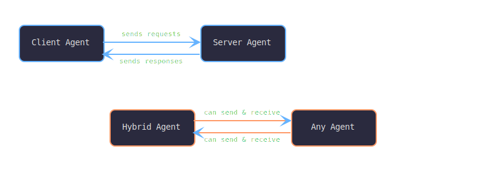
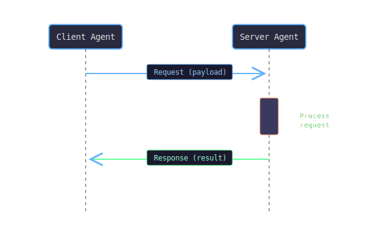
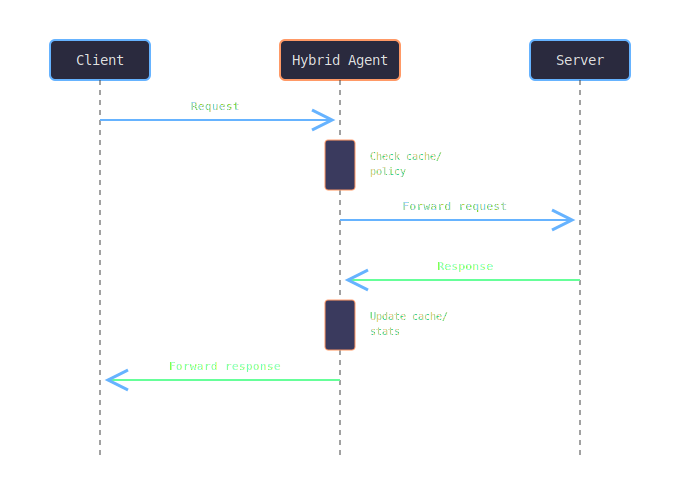

# Agent Types

Agent99 supports three fundamental agent types, each designed for different communication patterns and use cases. Understanding these types is crucial for designing effective distributed systems.

## Overview



## Server Agents

Server agents **receive and respond to requests** from other agents. They're the workhorses of the Agent99 ecosystem.

### Characteristics

- **Reactive**: Wait for incoming requests
- **Stateless**: Each request is handled independently (by default)
- **Specialized**: Usually focus on specific capabilities
- **Discoverable**: Register their capabilities for others to find

### Example: Server Agent

```ruby
class WeatherAgent < Agent99::Base
  def info
    {
      name: self.class.to_s,
      type: :server,  # This makes it a server agent
      capabilities: ['weather', 'forecast', 'temperature']
    }
  end

  def process_request(payload)
    location = payload.dig(:location)
    
    # Simulate weather lookup
    weather_data = {
      location: location,
      temperature: rand(15..35),
      condition: ['sunny', 'cloudy', 'rainy'].sample,
      timestamp: Time.now.iso8601
    }
    
    send_response(weather_data)
  end
end
```

### When to Use Server Agents

- **Services**: Database access, calculations, data processing
- **APIs**: Wrapping external APIs or services  
- **Workers**: Background job processing
- **Specialists**: Domain-specific functionality

## Client Agents

Client agents **make requests to other agents** and handle their responses. They're the initiators of communication.

### Characteristics

- **Proactive**: Initiate communication
- **Discovery-aware**: Find and connect to appropriate services
- **Request-driven**: Send requests and wait for responses
- **Orchestrating**: Can coordinate multiple service calls

### Example: Client Agent

```ruby
class WeatherClientAgent < Agent99::Base
  def info
    {
      name: self.class.to_s,
      type: :client,  # This makes it a client agent
      capabilities: ['weather_requester', 'data_aggregator']
    }
  end

  def get_weather_report(locations)
    # Find weather service agents
    weather_agents = discover_agents(['weather'])
    
    if weather_agents.empty?
      logger.warn "No weather agents available"
      return nil
    end

    weather_agent = weather_agents.first
    reports = []

    locations.each do |location|
      request = { location: location }
      response = send_request(weather_agent[:name], request)
      reports << response if response
    end

    reports
  end
end
```

### When to Use Client Agents

- **Aggregators**: Combine data from multiple sources
- **Workflows**: Multi-step business processes
- **User Interfaces**: Frontend applications
- **Schedulers**: Time-based or event-driven tasks

## Hybrid Agents

Hybrid agents can **both send and receive requests**. They're the most flexible but also the most complex.

### Characteristics

- **Bidirectional**: Can act as both client and server
- **Mediating**: Often serve as intermediaries or proxies
- **Stateful**: May maintain state across interactions
- **Complex**: Handle multiple communication patterns

### Example: Hybrid Agent

```ruby
class WeatherProxyAgent < Agent99::Base
  def initialize
    super
    @cache = {}  # Simple caching
    @stats = { requests: 0, cache_hits: 0 }
  end

  def info
    {
      name: self.class.to_s,
      type: :hybrid,  # This makes it a hybrid agent
      capabilities: ['weather_proxy', 'caching', 'analytics']
    }
  end

  # Server behavior: respond to weather requests
  def process_request(payload)
    location = payload.dig(:location)
    @stats[:requests] += 1

    # Check cache first
    if @cache[location] && fresh_enough?(@cache[location])
      @stats[:cache_hits] += 1
      logger.info "Cache hit for #{location}"
      send_response(@cache[location][:data])
      return
    end

    # Cache miss - get from weather service
    weather_data = fetch_weather_data(location)
    
    if weather_data
      @cache[location] = {
        data: weather_data,
        timestamp: Time.now
      }
      send_response(weather_data)
    else
      send_error("Weather data unavailable for #{location}")
    end
  end

  # Client behavior: request from actual weather service
  private def fetch_weather_data(location)
    weather_agents = discover_agents(['weather'])
    return nil if weather_agents.empty?

    weather_agent = weather_agents.first
    request = { location: location }
    send_request(weather_agent[:name], request)
  end

  private def fresh_enough?(cache_entry)
    Time.now - cache_entry[:timestamp] < 300  # 5 minutes
  end

  # Additional hybrid behavior: provide statistics
  def get_statistics
    {
      total_requests: @stats[:requests],
      cache_hits: @stats[:cache_hits],
      cache_hit_rate: @stats[:requests] > 0 ? @stats[:cache_hits].to_f / @stats[:requests] : 0
    }
  end
end
```

### When to Use Hybrid Agents

- **Proxies**: Caching, load balancing, protocol translation
- **Middleware**: Authentication, logging, monitoring
- **State Managers**: Session management, workflow coordination
- **Aggregators**: Collect, process, and redistribute data

## Agent Type Comparison

| Feature | Server | Client | Hybrid |
|---------|--------|--------|---------|
| **Receives Requests** | ✅ | ❌ | ✅ |
| **Sends Requests** | ❌ | ✅ | ✅ |
| **Complexity** | Low | Medium | High |
| **Statefulness** | Usually stateless | Can be stateful | Often stateful |
| **Use Cases** | Services, APIs | UIs, Schedulers | Proxies, Middleware |

## Communication Patterns

### Request-Response (Server/Client)



### Proxy Pattern (Hybrid)



## Best Practices

### Server Agents

1. **Keep them focused**: One capability per agent
2. **Make them stateless**: Each request independent
3. **Validate inputs**: Use schemas for safety
4. **Handle errors gracefully**: Always respond, even on error

### Client Agents

1. **Handle service unavailability**: Graceful degradation
2. **Use timeouts**: Don't wait forever
3. **Implement retries**: With exponential backoff
4. **Cache discoveries**: Don't rediscover every time

### Hybrid Agents

1. **Separate concerns**: Clear distinction between client/server logic
2. **Manage state carefully**: Consider thread safety
3. **Monitor performance**: Track both directions
4. **Document behavior**: Complex interactions need clear docs

## Choosing the Right Type

Ask yourself:

- **Do I need to respond to requests?** → Server or Hybrid
- **Do I need to make requests?** → Client or Hybrid  
- **Do I need both?** → Hybrid
- **Is simplicity important?** → Avoid Hybrid if possible
- **Is this a leaf service?** → Probably Server
- **Is this an orchestrator?** → Probably Client
- **Is this middleware?** → Probably Hybrid

## Next Steps

- **[Agent Lifecycle](agent-lifecycle.md)** - How agents start, run, and stop
- **[Architecture Overview](architecture.md)** - How agents fit into the bigger picture
- **[Custom Agent Implementation](../agent-development/custom-agent-implementation.md)** - Build your own agents