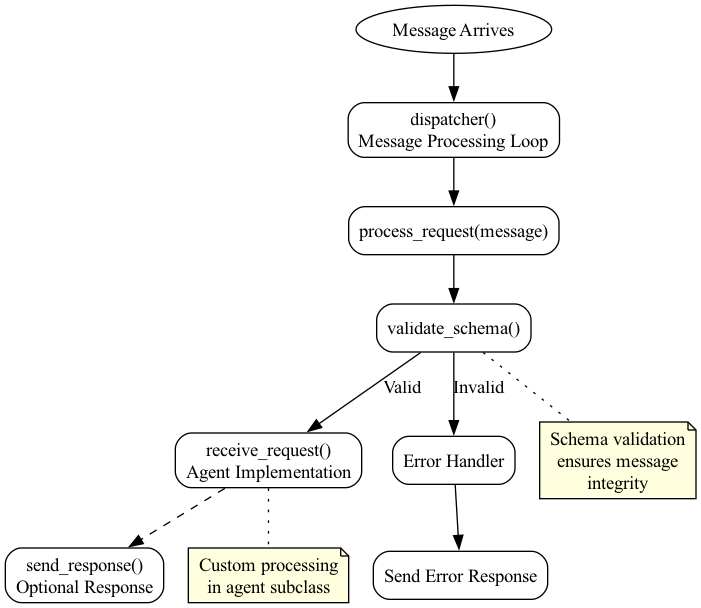

# Agent99 Framework

## Message Processing

The Agent99 framework implements a robust message processing system that handles three main types of
messages: Request, Response, and Control messages. Each message type follows specific processing flows
and validation rules.

### Message Types

1. **Request Messages**
    - Sent by clients to request services or actions
    - Must include a valid schema definition
    - Processed through the `receive_request` handler
    - Automatically validated against REQUEST_SCHEMA
    - Can trigger responses back to the sender

2. **Response Messages**
    - Sent in reply to requests
    - Contain results or error information
    - Processed through the `receive_response` handler
    - Include original request reference
    - May trigger additional processing flows

3. **Control Messages**
    - Manage agent lifecycle and behavior
    - Include actions like shutdown, pause, resume
    - Processed through dedicated control handlers
    - Support configuration updates
    - Enable status monitoring

### Message Processing Flow

#### Request Processing
1. Message arrives and is validated against schema
2. If validation passes:
    - `receive_request` is called
    - Custom processing occurs
    - Optional response is sent
3. If validation fails:
    - Error response is automatically sent
    - Error is logged
    - Request is not processed further



#### Response Processing
1. Response message is received
2. `receive_response` handler is called
3. Response data is processed
4. Any follow-up actions are triggered

#### Control Processing
1. Control message is received
2. Action is identified
3. Appropriate handler is called:
    - `handle_shutdown`
    - `handle_pause`
    - `handle_resume`
    - `handle_update_config`
    - `handle_status_request`
4. Control response is sent if needed

### Error Handling

The framework provides comprehensive error handling:

1. **Validation Errors**
    - Schema validation failures
    - Missing required fields
    - Invalid data types

2. **Processing Errors**
    - Handler exceptions
    - Resource unavailability
    - Timeout conditions

3. **System Errors**
    - Connection issues
    - Resource constraints
    - Framework-level problems

### Best Practices

1. **Message Validation**
    - Always define REQUEST_SCHEMA for request-handling agents
    - Include comprehensive examples in schema
    - Validate message structure

2. **Error Handling**
    - Implement robust error handling in handlers
    - Return meaningful error messages
    - Log all significant events

3. **Response Management**
    - Send responses promptly
    - Include relevant context
    - Handle partial success cases

4. **Control Messages**
    - Respond to all control messages
    - Implement graceful shutdown
    - Maintain agent state properly

### Implementation Example

```ruby
class MyAgent < Agent99::Base
  REQUEST_SCHEMA = {
    type: "object",
    properties: {
      header: HEADER_SCHEMA,
      data: {
        type: "object",
        required: ["action"],
        properties: {
          action: { type: "string" }
        }
      }
    }
  }

  def receive_request
    action = payload.dig(:data, :action)
    result = process_action(action)
    send_response(result)
  rescue StandardError => e
    send_response(error: e.message)
  end

  private

  def process_action(action)
    # Custom processing logic
    { status: "success", result: action }
  end
end
```

### Message Structure

All messages must include a header with:
* `type`: Message type (request/response/control)
* `to_uuid`: Destination agent ID
* `from_uuid`: Sender agent ID
* `event_uuid`: Unique event identifier
* `timestamp`: Message creation time

Example message structure:
```ruby
{
  header: {
    type: "request",
    to_uuid: "agent_123",
    from_uuid: "agent_456",
    event_uuid: "evt_789",
    timestamp: 1638360000000000
  },
  data: {
    # Message-specific payload
  }
}
```


