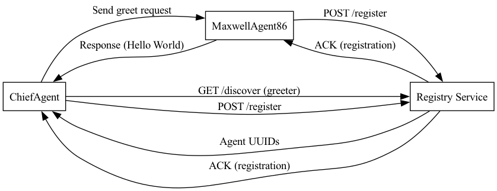

# Agent99 Framework Examples - 86 and the Chief

This folder contains example implementations using the Agent99 framework. The framework provides a foundation for building AI agents that can communicate with each other through a message-based system.

## Files

### 1. maxwell_agent86.rb

This file demonstrates a basic agent implementation using the Agent99 framework.

- Class: `MaxwellAgent86 < Agent99::Base`
- Functionality: Responds to "hello world" requests
- Key methods:
  - `receive_request`: Handles incoming requests
  - `validate_request`: Validates the request against a schema
  - `process`: Generates the response

### 2. chief_agent.rb

This file shows how to create a client that interacts with the MaxwellAgent86 agent.

- Class: `ChiefAgent < Agent99::Base`
- Functionality: Sends a request to an agent who can be a greeter and processes the response
- Key methods:
  - `init`: Initiates the request sending process
  - `send_request`: Builds and sends the request
  - `receive_response`: Handles the response from the HelloWorld agent

### 3. mexwell_request.rb

This file defines the schema for MaxwellAgent86 requests using SimpleJsonSchemaBuilder.

- Class: `MaxwellRequest < SimpleJsonSchemaBuilder::Base`
- Defines the structure of a valid HelloWorld request

### 4. registry.rb

This file implements a simple registry service for AI agents using Sinatra.

- Functionality: Allows agents to register, discover other agents, and withdraw from the registry
- Endpoints:
  - GET `/healthcheck`: Returns the number of registered agents
  - POST `/register`: Registers a new agent
  - GET `/discover`: Discovers agents by capability
  - DELETE `/withdraw/:uuid`: Withdraws an agent from the registry
  - GET `/`: Lists all registered agents

### 5. control_agent.rb

Example use of control messages.

### 6. kaos_spy.rb
  - Agent 99 was kinnapped by KAOS and forced to reveal the secrets of Control's centralized registry and communications network.
  - The KAOS spy raided hacked the registry, stole the records for all of Control's agents in the field and DOX'ed them on social media.
  - That was not enough for KAOS.  Knowing the secret UUID for each agent, KAOS proceeded to turn off the communication network one queue at a time.
  - Get Smart -- Get Security

## Usage

From the examples directory you will need to start three different processes.  You will want to keep them all in the forgound so it would be best to start them in different terminal windows.

Start the sample registry first: `./registry.rb`

Then start the service agent: `./maxwell_agent86.rb`
Maxwell will will register itself, get its UUID and setup a message queue to which it will listen for its service requests.

Finally start the chief agent in charge: `./chief_agent.rb`
The Chief also registers itself but no other agent can give the Chief missions.  That's his job.  The chief gets his mission UUID, sets up a message queue to listen for the reports from the field after he sends out his request (aka order)

But first the Chief asks the registry for the UUIDs of all agents who can handle a "greeter" request.  The Chief selects one of those agents and sends the agent a greet request.  The Chief then waits for a response to the request.  When it comes in, the chiefs displays the response and terminates.

Run the chief a few times in a roll.  Some times the agent to whom the Chief issues his requests does not always respond the you would expect.

