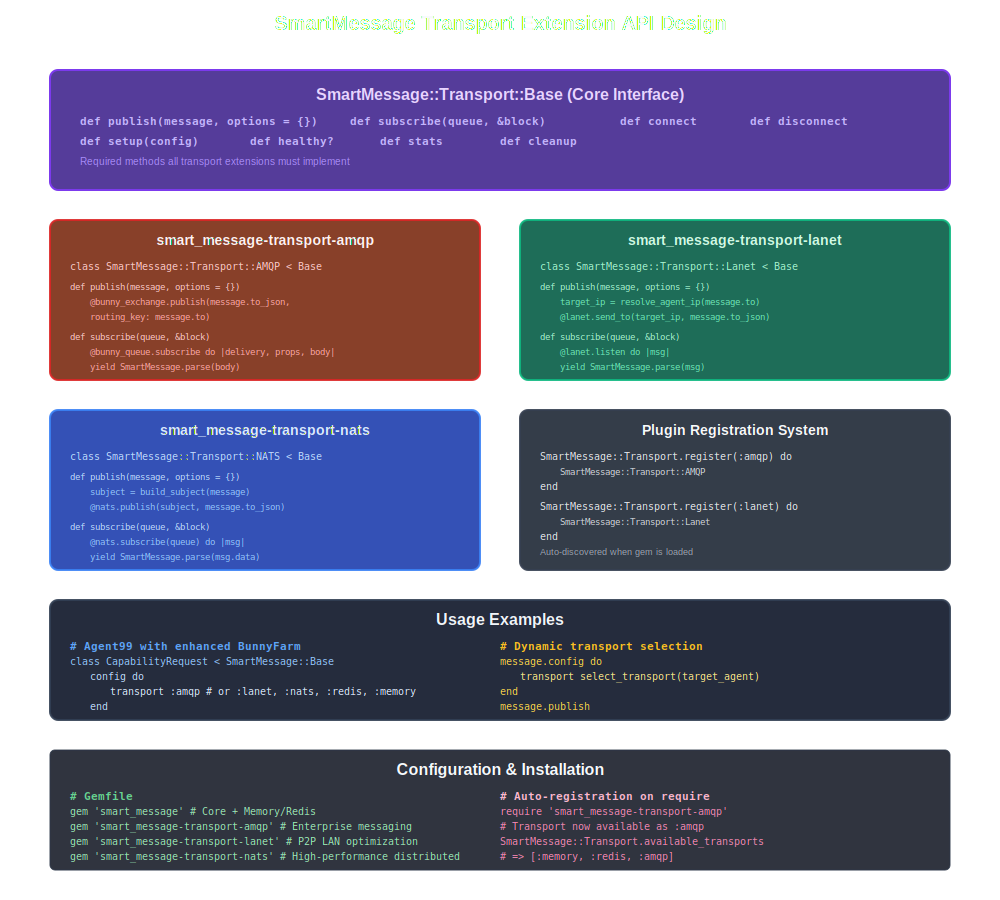

# Agent99 Peer-to-Peer Communication Plan

## Current Architecture Analysis

### What Exists
- **Central Registry**: Agent discovery via `lib/agent99/registry_client.rb`
- **Message Brokers**: NATS/AMQP routing via `lib/agent99/nats_message_client.rb` and `lib/agent99/amqp_message_client.rb`
- **Broker-based Communication**: Agents communicate through broker queues using agent UUIDs
- **Hub-and-spoke Model**: All messages flow through centralized message brokers

### What's Missing for True P2P
- Direct agent-to-agent communication without broker intermediation
- Peer discovery mechanisms beyond the central registry
- Network overlay or mesh topology for direct connections
- NAT traversal and connection establishment protocols
- Bandwidth optimization for high-volume data transfers

## P2P Implementation Approaches

### 1. Hybrid Approach (Recommended)
Keep existing broker-based communication for initial discovery and control, add direct P2P for data transfer.

**Pros:**
- Builds on existing infrastructure
- Maintains compatibility with current agents
- Provides fallback mechanism
- Lower implementation complexity

**Cons:**
- Still dependent on broker for some operations
- More complex routing logic

**Implementation:**
- Use registry + broker for initial handshake and capability discovery
- Establish direct TCP/UDP connections for high-volume data exchange
- Fallback to broker when direct connection fails

### 2. DHT-Based P2P Network
Implement a distributed hash table for fully decentralized discovery.

**Pros:**
- Fully decentralized after bootstrap
- High scalability
- No single point of failure

**Cons:**
- High implementation complexity
- Network partitioning challenges
- Eventual consistency issues

**Implementation:**
- Each agent maintains partial network state
- Chord, Kademlia, or similar DHT algorithm
- No central registry dependency after bootstrap

### 3. WebRTC-Style P2P
Use signaling server (existing registry) for connection establishment.

**Pros:**
- Works across NAT/firewalls
- Proven protocol design
- Direct peer connections

**Cons:**
- Complex NAT traversal implementation
- Requires STUN/TURN servers
- WebRTC protocol overhead

**Implementation:**
- ICE/STUN/TURN-like protocols for NAT traversal
- Direct peer connections after handshake
- Signaling through existing registry

### 4. Gossip Protocol Network
Epidemic-style information spreading for network state.

**Pros:**
- High resilience to node failures
- Eventually consistent
- Self-healing network

**Cons:**
- Message overhead
- Convergence time
- Potential for network storms

**Implementation:**
- Agents exchange peer lists and capabilities
- Eventually consistent network state
- Periodic gossip rounds

## Recommended Implementation Plan

### Phase 1: Direct Connection Framework
**Goal:** Add basic direct TCP communication alongside existing broker system

**Components to Add:**
- `lib/agent99/tcp_message_client.rb` - Direct TCP communication
- `lib/agent99/p2p_connection_manager.rb` - Connection pooling and lifecycle
- `lib/agent99/routing_strategy.rb` - Smart message routing (direct vs broker)

**Implementation Steps:**
1. Add TCP server capability to each agent
2. Implement direct message sending alongside broker publishing
3. Connection pooling and management
4. Basic routing decision logic (prefer direct, fallback to broker)

### Phase 2: Smart Routing and Optimization
**Goal:** Intelligent message routing with performance optimization

**Components to Add:**
- Connection health monitoring and metrics
- Bandwidth/latency optimization
- Load balancing across connections
- Connection retry and fallback logic

**Implementation Steps:**
1. Route messages directly when possible, via broker when not
2. Connection health monitoring and fallback logic
3. Performance metrics collection
4. Adaptive routing based on connection quality

### Phase 3: Advanced P2P Features
**Goal:** Full P2P capabilities with NAT traversal

**Components to Add:**
- NAT traversal using STUN/TURN techniques
- Mesh topology optimization
- Advanced peer discovery
- Network resilience features

**Implementation Steps:**
1. NAT traversal implementation
2. Mesh topology optimization
3. Advanced load balancing
4. Network partition handling

## Technical Considerations

### Message Routing Strategy
- **Direct Connection**: For high-volume, low-latency communication
- **Broker Fallback**: When direct connection unavailable or fails
- **Hybrid Mode**: Use both simultaneously for redundancy

### Connection Management
- Connection pooling to avoid overhead
- Health checks and automatic reconnection
- Graceful degradation when connections fail
- Resource cleanup on agent shutdown

### Security Implications
- Authentication for direct connections
- Message encryption for P2P communication
- Authorization and access control
- Protection against malicious peers

### Performance Considerations
- Connection overhead vs message routing efficiency
- Memory usage for connection pools
- Network bandwidth optimization
- Latency reduction for direct communication

## Multi-Gem Integration Strategy - Revised Approach

### Enhanced BunnyFarm + SmartMessage Extension Architecture

**Strategic Insight**: Instead of integrating four separate gems, enhance BunnyFarm with SmartMessage capabilities first, creating a powerful messaging foundation for Agent99. Use extension gems for transport modularity.

**Revised Architecture:**


The integrated architecture provides clean separation of concerns with enhanced BunnyFarm as the unified messaging layer, supported by modular transport extensions.

## BunnyFarm + SmartMessage Integration Analysis

### BunnyFarm Overview
BunnyFarm is a lightweight Ruby gem for managing background jobs using RabbitMQ with message-centric design.

**Current BunnyFarm Capabilities:**
- **Message-as-Classes**: Messages are "living entities" with routing logic
- **Automatic Routing**: `ClassName.action` routing keys
- **Workflow Support**: Multi-step processing with success/failure tracking
- **K.I.S.S. Design**: Simple, straightforward approach
- **Flexible Configuration**: ENV vars, programmatic, or YAML config

### SmartMessage Enhancement Strategy

**Replace `BunnyFarm::Message` with `SmartMessage::Base`:**
```ruby
# Enhanced BunnyFarm using SmartMessage
class CapabilityRequest < SmartMessage::Base
  config do
    transport BunnyFarm::Transport.new  # Retains workflow capabilities
    serializer SmartMessage::Serializer::JSON.new
  end
  
  # BunnyFarm's workflow methods
  def process
    # Message processing with transport abstraction
  end
  
  def success
    # Success handling across any transport
  end
  
  def failure  
    # Failure handling with transport flexibility
  end
end
```

### Enhanced BunnyFarm Benefits
1. **Unified Messaging System**: SmartMessage transport abstraction + BunnyFarm workflows
2. **Multi-Transport Workflows**: Run BunnyFarm patterns across AMQP, Lanet, NATS
3. **Stronger Foundation**: Single enhanced gem vs multiple integrations
4. **Reusable Components**: Enhanced BunnyFarm benefits other projects
5. **Proven Patterns**: Combines best of both architectural approaches

## Lanet Gem Integration Analysis

### Lanet Overview
Lanet is a Ruby gem for lightweight P2P LAN communication with built-in security and network discovery.

**Key Capabilities:**
- **Security**: AES-256-CBC encryption + RSA digital signatures
- **Network Discovery**: Automatic device scanning and detection
- **Communication Modes**: Direct messaging, broadcasting, encrypted transfers
- **Decentralized Routing**: Self-healing meshnet topology
- **Ruby-native**: Clean integration potential with Agent99

### Integrated Three-Gem Strategy

**Recommended Approach: SmartMessage + Lanet + Existing Brokers**
- **SmartMessage provides unified messaging API** across all transports
- **Lanet handles LAN P2P communication** (high-performance local scenarios)  
- **Existing NATS/AMQP brokers handle WAN** communication and initial discovery
- **Registry remains** for global agent discovery and coordination

**Implementation Benefits:**
- **Unified API**: SmartMessage provides consistent interface across all transports
- **Transport Abstraction**: Easy to switch or combine Lanet, NATS, AMQP
- **Proven Components**: Leverages existing gems rather than custom implementation
- **Built-in Security**: Lanet's encryption + SmartMessage's serialization
- **Flexible Routing**: SmartMessage can intelligently choose transport based on recipient

**Integration Points:**
```ruby
# SmartMessage transport plugins for Agent99
class Agent99::LanetTransport < SmartMessage::Transport::Base
  def initialize(options = {})
    @lanet_sender = Lanet::Sender.new
    @lanet_receiver = Lanet::Receiver.new
  end
  
  def publish(message, options = {})
    target_ip = resolve_agent_ip(message.to)
    @lanet_sender.send_to(target_ip, message.to_json, encrypt: true)
  end
end

# Agent message classes using SmartMessage
class Agent99::RequestMessage < SmartMessage::Base
  config do
    # Automatically choose best transport based on target
    transport Agent99::SmartTransport.new
    serializer SmartMessage::Serializer::JSON.new
  end
  
  # Agent99 can now use clean messaging API
  def send_capability_request(target_agent, capability)
    publish :capability_request, 
            to: target_agent, 
            capability: capability
  end
end
```

**Smart Transport Selection Strategy:**


**Agent99 Multi-Process Transport Selection:**
1. **Same Process**: Memory transport (instant delivery)
2. **Same Machine (Direct)**: Named Pipes transport (OS-level IPC)
3. **Same Machine (Pub/Sub)**: Redis transport (local pub/sub)
4. **Same LAN**: Lanet transport (P2P encrypted)
5. **Reliable Required**: AMQP transport (guaranteed delivery)
6. **High Performance**: NATS transport (distributed coordination)

**Transport Performance Characteristics:**
- **Memory**: ~1μs latency (in-process)
- **Named Pipes**: ~25μs latency (kernel-level IPC)
- **Redis**: ~100μs latency (local network stack)
- **Lanet**: ~1ms latency (LAN P2P encrypted)
- **NATS**: ~2ms latency (high-performance distributed)
- **AMQP**: ~5ms latency (reliable enterprise messaging)

## Network Topology and Message Flow

### Hybrid P2P Network Architecture


The network topology shows how agents communicate within LANs using Lanet P2P while using brokers for cross-network communication.

### Message Flow Sequence


The sequence diagram illustrates the complete message flow from source agent through SmartMessage transport selection to target agent delivery.

## SmartMessage Transport Extension System

### Extension Gem Architecture

**Modular Transport Design:**
- **Core SmartMessage**: Lightweight with Memory + Redis transports
- **Extension Gems**: Optional transport implementations
- **Plugin System**: Auto-registration when gems are loaded
- **Unified API**: Same interface across all transports



### Extension Gem Structure

**Recommended Extension Gems:**
```ruby
# Core lightweight gem
gem 'smart_message'                         # Memory + Redis

# Transport extensions (install as needed)
gem 'smart_message-transport-named_pipes'   # OS-level IPC for same-machine
gem 'smart_message-transport-amqp'          # Enterprise reliability
gem 'smart_message-transport-lanet'         # LAN P2P optimization
gem 'smart_message-transport-nats'          # High-performance distributed
```

## Named Pipes Transport Design

### Naming Convention & Configuration

**Standard Naming Pattern:**
```
/tmp/agent99/pipes/{namespace}/{agent_id}.{direction}.pipe
```

**Components:**
- **Base Path**: `/tmp/agent99/pipes/` (configurable via ENV)
- **Namespace**: Group agents by application/environment
- **Agent ID**: Unique agent identifier (UUID or name)
- **Direction**: `in` (receive) or `out` (send) for unidirectional pipes
- **Extension**: `.pipe` for clarity

**Configuration Options:**
```ruby
class SmartMessage::Transport::NamedPipes
  DEFAULT_CONFIG = {
    base_path: ENV['AGENT99_PIPE_BASE'] || '/tmp/agent99/pipes',
    namespace: ENV['AGENT99_NAMESPACE'] || 'default',
    mode: :unidirectional,      # Recommended for avoiding deadlocks
    permissions: 0600,           # Owner read/write only
    cleanup: true,              # Delete pipes on shutdown
    buffer_size: 65536          # 64KB default buffer
  }
end
```

### Named Pipes vs Redis Comparison

**Named Pipes Advantages:**
- **Performance**: 4x faster than Redis (~25μs vs ~100μs)
- **Zero Dependencies**: No Redis server required
- **Lower Resources**: Direct kernel communication
- **Native OS Support**: Built into all *nix systems
- **File System Security**: OS-level permission control

**Redis Advantages:**
- **Persistence**: Survives process restarts
- **Pub/Sub**: Built-in fan-out capabilities
- **Network Ready**: Can scale across machines
- **Mature Tooling**: Extensive debugging tools

**Selection Strategy:**
```ruby
def select_same_machine_transport(message_type)
  if persistence_required?(message_type) || fan_out_required?(message_type)
    :redis  # Complex scenarios requiring pub/sub or persistence
  else
    :named_pipes  # Default for direct agent-to-agent communication
  end
end
```

### Transport Extension Benefits

**Modular Architecture Advantages:**
1. **Lightweight Core**: SmartMessage stays minimal with essential transports
2. **Optional Dependencies**: Users install only needed transport gems
3. **Independent Evolution**: Each transport can develop at its own pace
4. **Community Growth**: Plugin ecosystem encourages transport contributions
5. **Flexible Deployment**: Choose transports based on infrastructure needs
6. **Performance Optimization**: Named pipes for local, Redis for pub/sub

### Technical Considerations

**Message Format Adaptation:**
- SmartMessage handles JSON serialization uniformly across all transports
- Agent99 message headers map to SmartMessage entity addressing (FROM/TO/REPLY_TO)
- Enhanced BunnyFarm workflow methods (process/success/failure) work across transports
- Maintain compatibility with existing Agent99 message structure

**Transport Selection Logic:**
- Intelligent routing based on target agent location and message requirements
- Automatic fallback mechanisms when preferred transport unavailable
- Performance optimization through transport-specific configurations
- Health monitoring and connection management per transport

**Security Integration:**
- Transport-specific security implementations (Lanet encryption, AMQP SSL, etc.)
- SmartMessage can layer additional security through serialization
- Enhanced BunnyFarm maintains message workflow integrity across transports
- Centralized key management through Agent99 registry integration

## Revised Implementation Roadmap

### Phase 1: Enhanced BunnyFarm Foundation (Weeks 1-4)
1. **BunnyFarm + SmartMessage Integration**: 
   - Replace `BunnyFarm::Message` with `SmartMessage::Base`
   - Migrate BunnyFarm's workflow capabilities to SmartMessage pattern
   - Maintain automatic routing and configuration flexibility
2. **Multi-Transport Support**: 
   - Add transport abstraction while preserving BunnyFarm workflows
   - Implement AMQP transport plugin using existing BunnyFarm patterns
   - Design plugin architecture for future transports
3. **Enhanced Workflow System**:
   - Extend BunnyFarm's process/success/failure pattern across transports
   - Add SmartMessage entity addressing (FROM/TO/REPLY_TO)
   - Maintain BunnyFarm's K.I.S.S. design philosophy

### Phase 2: Agent99 Integration (Weeks 5-6)
1. **Replace Agent99's AMQP Client**: 
   - Substitute basic AMQP client with enhanced BunnyFarm
   - Map Agent99 message patterns to enhanced BunnyFarm workflows
   - Maintain existing Agent99 API compatibility
2. **Workflow Integration**: 
   - Leverage enhanced BunnyFarm's workflow capabilities for agent processing
   - Add success/failure handling to Agent99 message types
   - Implement automatic routing for agent-to-agent communication

### Phase 3: Lanet P2P Integration (Weeks 7-8)
1. **Lanet Transport Plugin**: 
   - Add Lanet transport to enhanced BunnyFarm system
   - Implement BunnyFarm workflow patterns over Lanet P2P
   - Network discovery integration (registry + Lanet scanning)
2. **Intelligent Routing**: 
   - Smart transport selection (LAN via Lanet, WAN via AMQP)
   - Fallback mechanisms and connection health monitoring
   - Complete hybrid P2P system with workflow support

### Phase 4: Production Readiness (Weeks 9-10)
1. **System Integration**: 
   - End-to-end testing of Agent99 + Enhanced BunnyFarm + Lanet
   - Performance optimization and monitoring
   - Documentation and migration guides
2. **Advanced Features**: 
   - Load balancing and auto-scaling capabilities
   - Advanced security and authentication integration
   - Backward compatibility validation

## Open Questions

### General P2P Questions
1. Should we maintain backward compatibility with pure broker-based agents?
2. How do we handle network partitions in hybrid mode?
3. What's the strategy for handling firewall/NAT scenarios in corporate environments?
4. How do we manage connection limits and resource usage?
5. What metrics should we collect for P2P connection health?

### Enhanced BunnyFarm + SmartMessage Questions
6. How do we migrate BunnyFarm's message workflows to SmartMessage without losing functionality?
7. Can BunnyFarm's automatic routing (`ClassName.action`) work with SmartMessage transport abstraction?
8. How do we maintain BunnyFarm's configuration flexibility while adding transport plugins?
9. What's the performance impact of adding transport abstraction to BunnyFarm workflows?

### Transport Extension Questions
10. Should transport extensions be auto-loaded or explicitly required?
11. How do we handle version compatibility between core SmartMessage and transport extensions?
12. What's the plugin registration mechanism for transport discovery?
13. How do we manage transport-specific configuration and connection pooling?

### Lanet Integration Questions  
14. How does Lanet handle enhanced BunnyFarm workflow messages?
15. Can Lanet's network discovery integrate with Agent99's registry system?
16. What are Lanet's performance characteristics compared to other transports?
17. How should we handle key management for Lanet's encryption across multiple agents?

### NATS Integration Questions
18. How does NATS subject-based routing map to Agent99's capability-based routing?
19. Can NATS handle enhanced BunnyFarm workflow patterns effectively?
20. What's the optimal NATS clustering strategy for Agent99 multi-process coordination?
21. How do we integrate NATS monitoring with Agent99's health check system?

## Summary

This revised plan proposes enhancing BunnyFarm with SmartMessage capabilities first, creating a powerful unified messaging foundation for Agent99's P2P evolution:

**Revised Strategy Benefits:**
- **Enhanced BunnyFarm Foundation**: Single powerful messaging gem instead of multiple integrations
- **Workflow-Enabled Multi-Transport**: BunnyFarm's process/success/failure patterns across all transports
- **Cleaner Architecture**: Agent99 builds on enhanced BunnyFarm rather than managing multiple gems
- **Stronger Foundation**: Enhanced BunnyFarm benefits other projects beyond Agent99
- **Proven Patterns**: Combines SmartMessage transport abstraction with BunnyFarm workflow design

**Key Advantages:**
- **Unified Messaging System**: Enhanced BunnyFarm becomes the messaging layer for Agent99
- **Automatic Optimization**: Smart routing (LAN via Lanet, WAN via AMQP) with workflow support
- **Built-in Security**: Lanet encryption + SmartMessage abstraction + BunnyFarm reliability
- **Extensibility**: Plugin architecture in enhanced BunnyFarm supports future transports
- **Reusability**: Enhanced BunnyFarm becomes valuable for broader Ruby ecosystem

**Strategic Impact:**
- Creates a more cohesive and maintainable architecture
- Reduces integration complexity while increasing capabilities
- Positions both BunnyFarm and Agent99 as leading Ruby messaging solutions
- Provides foundation for advanced AI agent communication patterns

This approach transforms both BunnyFarm and Agent99 into industry-leading tools while maintaining their core design philosophies.

---

*Last Updated: 2025-01-03*
*Status: Planning Complete - Ready for Implementation*